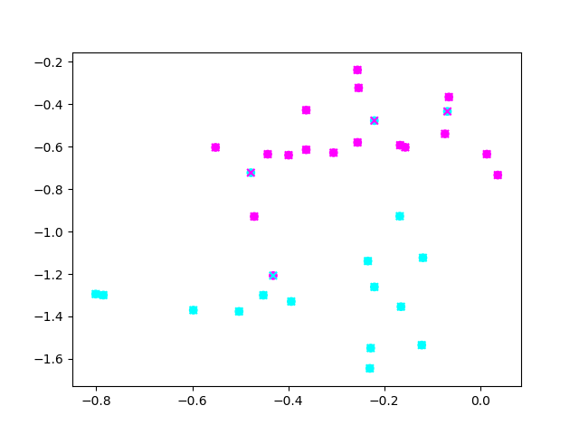

## Node2Vec-RL 
This project attempts to use RL in the random walk used by Node2Vec

So far, I have only implemented Q-learning (rather weakly at that) but the results speak for themselves.

# Without RL

# With RL

